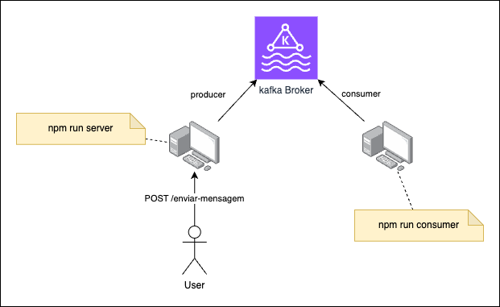
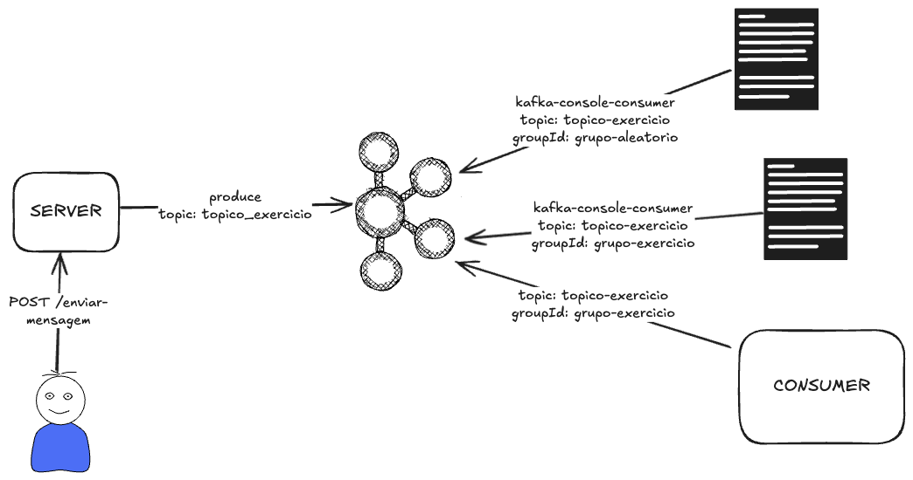

# Kafka Playground

## Sumário

- [Estrutura do projeto](#estrutura-do-projeto)
- [Configurações do Apache Kafka](#configurações-do-apache-kafka)
  - [Windows](./doc/CONFIG_WIN.md)
  - [Linux/macOS](./doc/CONFIG_LINUX_MAC.md)
- [Executando o Projeto](#executando-o-projeto)
- [Exercícios](#exercícios)
- [Referências](#referências)

## Estrutura do projeto

O projeto de exemplo consiste em uma aplicação que disponibiliza um enpoint `POST /enviar-mensagem` e publica uma mensagem no stream de eventos.

Além disso, temos um módulo que consome todos os eventos publicados.

A Figura a seguir apresenta um esquema deste projeto:



## Configurações do Apache Kafka

Certifique-se de que o seu sistema operacional possua o Java versão 17 ou superior instalado.

Faça o download do [Apache Kafka](https://dlcdn.apache.org/kafka/4.1.0/kafka_2.13-4.1.0.tgz). Descompacte os arquivos na pasta:

- Windows: `C:\kafka`.
- Linux/macOS: `~/kafka`.

Siga as instruções de configuração para o seu sistema operacional:
- [Windows](./doc/CONFIG_WIN.md)
- [Linux/macOS](./doc/CONFIG_LINUX_MAC.md)

## Executando o Projeto

Certifique-se de que o Apache Kafka esteja em execução.

Execute o comando para instalar as dependências:
```
npm install
```

Em uma instância do terminal, inicialize o servidor:
```
npm run server
```

Em outra instância do terminal, inicie o consumer:
```
npm run consumer
```

Utilize um client de sua preferência para enviar uma mensagem para o endpoint `POST /enviar-mensagem`.

A mensagem será publicada no stream de eventos e consumida pelo consumer.

## Exercícios

### Configurando tópicos, produtores e consumidores

1. Inicialize o serviço do Kafka e crie um tópico  chamado `topico-exercicio` com 3 partições utilizando o utilitário `kafka-topics` via terminal.
2. Modifique o [consumer](./src/eventstream/consumer/consumer.js) para consumir as mensagens do tópico `topico-exercicio` e conecte-se ao broker utiliznado o groupId `grupo-exercicio`.
3. Modifique o [producer](./src/eventstream/producer/producer.js) para publicar as mensagens no tópico `topico-exercicio`.
4. Abra duas instâncias do terminal e em uma delas conecte como consumer (`kafka-console-consumer`) utilizando o group id `grupo-exercicio` e se inscreva no tópico `topico-exercicio`. Na segunda instância, conecte como consumer utilizando o group id `grupo-aleatorio` e se inscreva no tópico `topico-exercicio`.
5. Execute os projetos em terminais distintos:
```bash
# Servidor de aplicação que publica as mensagens no Kafka
npm run server

# Consumer que consome as mensagens do Kafka
npm run consumer
```
Ao todo, você deve ter 5 aplicações em execução:
1. Kafka Broker
2. Consumer 1 - group id `grupo-exercicio` (via terminal - `kafka-console-consumer` )
3. Consumer 2 - group id `grupo-aleatorio` (via terminal - `kafka-console-consumer`)
4. Server - aplicação que publica as mensagens no Kafka (`npm run server`)
5. Consumer - aplicação que consome as mensagens do Kafka (`npm run consumer`)

Com as aplicações em execução, abra algum client REST de sua preferência (ex.: Rapid API) e envie uma mensagem para o endpoint `POST /enviar-mensagem` com algum payload de sua preferência.

Exemplo de requisição:

`POST http://localhost:3000/enviar-mensagem`

Payload:
```json
{
  "id": 1,
  "nome": "Denecley"
}
```

Verifique se as mensagens foram publicadas no Kafka e consumidas corretamente pelos consumidores.

Resumo da aplicação:



## Referências
- [Apache Kafka Quickstart](https://kafka.apache.org/quickstart)
- [Download Kafka](https://dlcdn.apache.org/kafka/4.1.0/kafka_2.13-4.1.0.tgz)
- [KafkaJS library](https://kafka.js.org/)