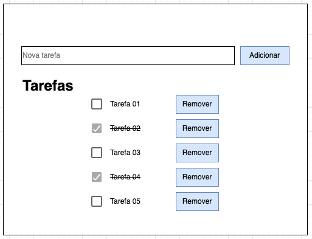

# Projeto MVC

Este projeto tem como objetivo mostrar uma aplicação organizada de acordo com as diretrizes do Model View Controller (MVC).

A pasta [src](./src) possui os principais arquivos de código fonte da aplicação. Cada camada está em sua respectiva pasta. Para fins de estudo, analise os arquivos na seguinte ordem:

- [app.js](./app.js)
- [routes/imoveis.js](./src/routes/imoveis.js)
- [controllers/imoveis.js](./src/controllers/imoveis.js)
- [models/imoveis.js](./src/models/imoveis.js)
- [views/imoveis](./src/views/imoveis/)

## Executando o projeto

Comando para executar o projeto:

```bash
npm start
```

## Exercícios

### 1. Lista de tarefas

Desenvolva uma aplicação com arquitetura em camadas (MVC) que faça o gerenciamento de uma lista de tarefas, seguindo as etapas abaixo.

#### 1.1 Configuração inicial

Crie um arquivo `.json` para a lista de tarefas, populado com dados iniciais. Modele o objeto que representa as tarefas de forma que seja possível identificar uma tarefa específica, exibir um título e verificar se ela já foi concluída.

Crie os módulos necessários para manipular tarefas, como rotas, controlador, modelo e visão, nos seus respectivos diretórios.

A aplicação terá apenas um template HTML que permite adicionar, remover ou marcar uma tarefa como concluída, de acordo com o protótipo a seguir.

<p align="center">
  
</p>

Nesta primeira etapa, a sua aplicação deve apenas exibir as tarefas existentes. Ou seja, não é necessário implementar nenhuma operação que modifique a lista de tarefas.


## Referências
- [Expressjs](https://expressjs.com/)
- [Embedded JavaScript templating](https://ejs.co/)
- [Node File System - fs](https://nodejs.org/api/fs.html)
- [Faker.js JSON Generator](https://faker-generator.netlify.app/)