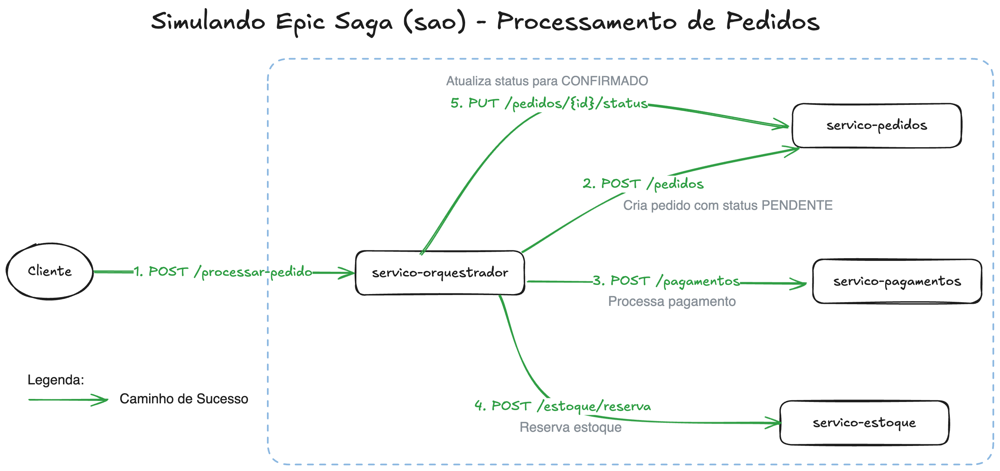

# Exercício 01 - Simulando Epic Saga (sao) - Processamento de Pedidos

# Sumário
- [Objetivo da Atividade](#objetivo-da-atividade)
- [Problema a ser Resolvido](#problema-a-ser-resolvido)
- [Arquitetura Proposta - Epic Saga (sao)](#arquitetura-proposta---epic-saga-sao)
- [Microserviços a serem Desenvolvidos](#microserviços-a-serem-desenvolvidos)
- [Contratos e Endpoints das APIs](#contratos-e-endpoints-das-apis)
- [Simulação de Falha](#simulação-de-falha)
- [Exemplos de fluxo de execução](#exemplos-de-fluxo-de-execução)

# Objetivo da Atividade
Desenvolver um conjunto de microserviços para simular o processamento de um pedido em um e-commerce. Implementar o padrão Epic Saga (sao) para garantir a consistência da operação, incluindo o tratamento de falhas através de transações de compensação.

# Problema a ser Resolvido
Em um sistema de e-commerce, o processo de "fechar um pedido" envolve três etapas distintas, cada uma tratada por um microserviço diferente:

1. Criação do Pedido: O pedido é registrado no sistema com um status inicial.
2. Processamento do Pagamento: O pagamento do pedido é efetuado.
3. Atualização de Estoque: A quantidade do produto comprado é debitada do estoque.

Todas essas etapas devem ocorrer de forma **atômica** do ponto de vista do negócio. Se qualquer uma delas falhar, o sistema inteiro deve ser revertido para o estado anterior, como se a transação nunca tivesse ocorrido.

# Saga Transacional - Epic Saga (sao)
A Epic Saga (sao) é um padrão de arquitetura que utiliza comunicação **síncrona**, consistência transacional **atômica** e a coordenação de transações é realizada por um serviço central chamado de **orquestrador**.

Assim, o orquestrador é responsável por chamar cada serviço participante na sequência correta e gerenciar qualquer falha que possa ocorrer.

# Microserviços a serem Desenvolvidos
Será necessário criar 4 aplicações simples em sua stack de preferência (por exemplo, 4 projetos com Express/Node.js, Flask/Python ou Spring Boot/Java):

## 1. Serviço de Orquestração (servico-orquestrador)

- `Função`: Ponto de entrada da saga. Recebe a requisição para criar um novo pedido e coordena as chamadas síncronas para os outros serviços. É o único serviço que conhece todo o fluxo de negócio. Em caso de falha, é sua responsabilidade invocar as transações de compensação.

## 2. Serviço de Pedidos (servico-pedidos)

- `Função`: Gerencia o ciclo de vida dos pedidos. Armazena os pedidos em memória (um simples dicionário ou lista).
- `Transação Local`: Cria um pedido com status `PENDENTE`.
- `Transação de Compensação`: Altera o status do pedido para `CANCELADO`.

## 3. Serviço de Pagamentos (servico-pagamentos)

- `Função`: Simula o processamento de pagamentos. Armazena os pagamentos aprovados em memória.
- `Transação Local`: Aprova um pagamento. Para simular falhas, ele pode ser programado para recusar pagamentos de um produto específico (ex: `produtoId: 0`).
- `Transação de Compensação`: Realiza o estorno (reembolso) de um pagamento previamente aprovado.

## 4. Serviço de Estoque (servico-estoque)

- `Função`: Gerencia a quantidade de produtos disponíveis. Armazena o inventário em memória (ex: um dicionário `{"produtoId": quantidade}`).
- `Transação Local`: Debita a quantidade de um produto do estoque. Pode falhar se não houver estoque suficiente.
- `Transação de Compensação`: Devolve a quantidade de um produto ao estoque (libera a reserva).

# Contratos e Endpoints das APIs

## 1. Serviço de Orquestração (servico-orquestrador)
### Endpoint `POST /processar-pedido`
Inicia a saga para a criação e processamento de um novo pedido.

#### Contrato de Entrada (Request Body):

```json
{
  "clienteId": "cliente-123",
  "produtoId": "produto-abc",
  "quantidade": 1,
  "valor": 150.00
}
```
#### Contrato de Saída (Response Body - Sucesso 201 Created):

```json
{
  "pedidoId": "uuid-gerado-pelo-servico-de-pedidos",
  "status": "PEDIDO_CONFIRMADO"
}
```
#### Contrato de Saída (Response Body - Falha 500 Internal Server Error):

```json
{
  "erro": "A saga falhou",
  "motivo": "Ex: Saldo insuficiente no estoque",
  "pedidoId": "uuid-do-pedido-cancelado"
}
```
## 2. Serviço de Pedidos (servico-pedidos)
### Endpoint `POST /pedidos`

Cria um novo pedido com status PENDENTE.

#### Contrato de Entrada: (O mesmo do Orquestrador)
```json
{
  "clienteId": "cliente-123",
  "produtoId": "produto-abc",
  "quantidade": 1,
  "valor": 150.00
}
```

#### Contrato de Saída (201 Created):
```json
{
  "pedidoId": "uuid-gerado-1",
  "status": "PENDENTE"
}
```

### Endpoint `PUT /pedidos/{id}/status`

Atualiza o status de um pedido (usado pelo orquestrador no final da saga ou na compensação).

#### Contrato de Entrada:
```json
{
  "status": "CONFIRMADO" // ou "CANCELADO"
}
```
#### Contrato de Saída (200 OK):

```json
{
  "pedidoId": "{id}",
  "status": "CONFIRMADO" // ou "CANCELADO"
}
```

## 3. Serviço de Pagamentos (servico-pagamentos)
### Endpoint `POST /pagamentos`

Processa um pagamento.

#### Contrato de Entrada:
```json
{
  "pedidoId": "uuid-gerado-1",
  "produtoId": "produto-abc", // Para simular falha
  "valor": 150.00
}
```

#### Contrato de Saída (201 Created):
```json
{
  "pagamentoId": "uuid-pagamento-1",
  "status": "APROVADO"
}
```
#### Falha: Retornar 400 Bad Request se o pagamento for recusado.

### Endpoint de Compensação: `POST /pagamentos/{id}/reembolso`

Reembolsa um pagamento.

#### Contrato de Saída (200 OK):
```json
{
  "pagamentoId": "{id}",
  "status": "REEMBOLSADO"
}
```

## 4. Serviço de Estoque (servico-estoque)
### Endpoint `POST /estoque/reserva`
Reserva (debita) itens do estoque.

#### Contrato de Entrada:

```json
{
  "pedidoId": "uuid-gerado-1",
  "produtoId": "produto-abc",
  "quantidade": 1
}
```
#### Contrato de Saída (200 OK):
```json
{
  "produtoId": "produto-abc",
  "estoque_restante": 99
}
```
#### Falha: Retornar 400 Bad Request se não houver estoque.

### Endpoint de Compensação: `POST /estoque/liberacao`

Libera uma reserva de estoque.

#### Contrato de Entrada: (Mesmo de /reserva)

#### Contrato de Saída (200 OK):

```json
{
  "produtoId": "produto-abc",
  "estoque_restante": 100
}
```

# Simulação de Falha

Para simular uma falha, você pode programar o serviço de pagamentos para recusar pagamentos a partir de valores específicos, como por exemplo:
- `produtoId: 0`: Produz uma falha no serviço de pedidos.
- `valor: 1000`: Produz uma falha no serviço de pagamentos.
- `quantidade: 500`: Produz uma falha no serviço de estoque.

# Exemplos de fluxo de execução

## Fluxo de execução com sucesso


## Fluxo de execução com transação compensatória

